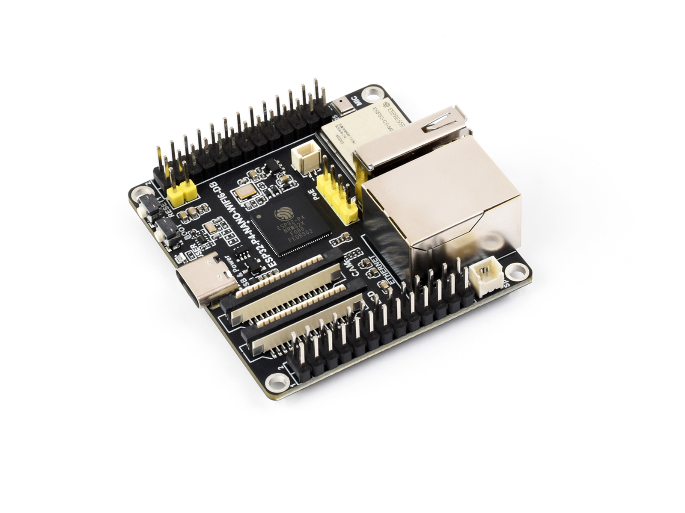
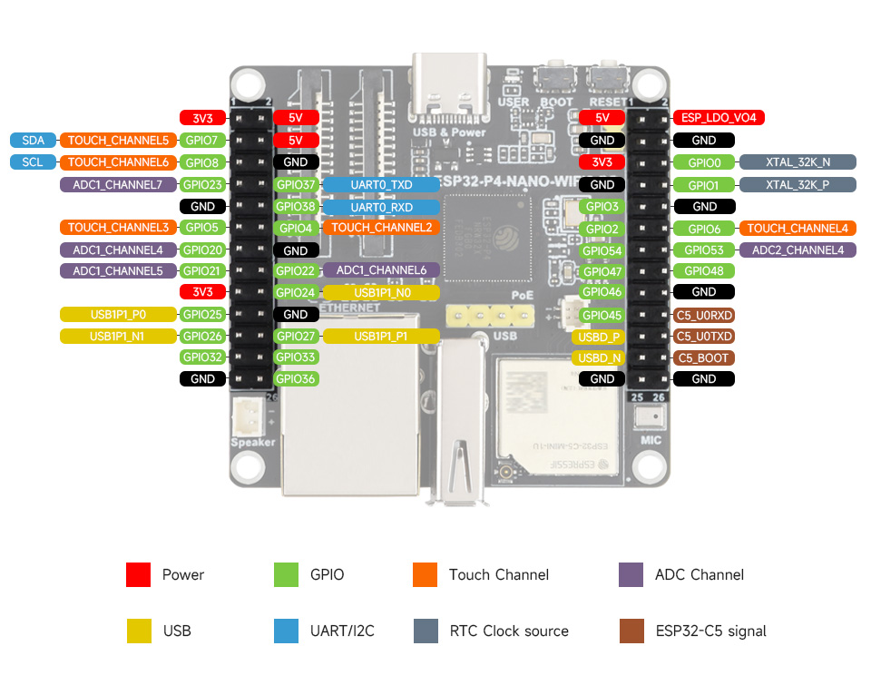

# ESP32-P4-NANO-WIFI6-DB

[Simplified Chinese](../../zh_CN/hw-reference/user-guide-esp32-p4-nano-wifi6-db.md)

ESP32-P4-NANO-WIFI6-DB is a development board built around the ESP32-P4NRW32X processor, paired with an ESP32-C5-MINI-1U wireless coprocessor over SDIO. It provides MIPI-DSI, MIPI-CSI, ES8311 audio, microSD, Ethernet, USB and expansion headers.



> **Note**
>
> This page is based on the [Nano BSP](../../../components/esp32_p4_nano_wifi6_db/) and [official documentation](https://docs.waveshare.net/ESP32-P4-NANO-WIFI6-DB/). See the [schematic](../../../hardware/schematics/ESP32-P4-NANO-WIFI6-DB.pdf) for circuit details.

## Onboard Resources

- **Main processor**: ESP32-P4NRW32X — dual-core high-performance RISC-V system and a low-power core, with 16 MB integrated PSRAM.
- **Flash**: 16 MB external NOR Flash; repository examples select 16 MB Flash.
- **Wireless coprocessor**: ESP32-C5-MINI-1U with external antenna, supporting 2.4 / 5 GHz Wi-Fi 6 and Bluetooth 5 LE. Applications communicate through ESP-Hosted over four-bit SDIO.
- **Programming port**: USB Type-C for 5 V power, firmware download and UART0 serial monitoring on GPIO37/GPIO38.
- **USB OTG**: Type-A connector for USB 2.0 High-Speed OTG. The BSP provides USB Host initialization through `bsp_usb_host_start()`.
- **Display**: Two-lane MIPI-DSI, with Kconfig-selectable HX8394 (5", 720×1280, 700 Mbps/lane), ILI9881C (7", 720×1280, 1000 Mbps/lane), or JD9365 (8" / 10.1", 800×1280, 1500 Mbps/lane). The default is the 10.1-inch panel. LCD reset is not wired; backlight control uses I2C.
- **Touch**: GT911 on the shared I2C bus. The BSP probes addresses `0x5D` and `0x14` and uses polling; reset and interrupt are not wired.
- **Audio**: ES8311 codec, onboard analog microphone, and speaker connector with amplifier enable on GPIO53.
- **Storage**: microSD over four-bit SDMMC, with active-low card power control on GPIO45 and IO power from LDO channel 4.
- **Camera**: Two-lane MIPI-CSI through `esp_video`; repository examples use OV5647. The BSP does not drive camera XCLK or RESET.
- **Ethernet**: 100 Mbps RJ45 interface with IP101GRI PHY, connected over RMII and SMI.
- **Expansion headers**: Two 2×13 headers carrying power, I2C, UART and GPIO signals. The BSP enumerates 22 GPIOs; some are shared with onboard peripherals.
- **Buttons / LEDs**: BOOT, RESET and power indicator. The BSP does not register buttons (`BSP_CAPS_BUTTONS=0`).
- **PoE**: Interface for a compatible optional PoE module.
- **ESP-IDF target**: `esp32p4`; the BSP requires ESP-IDF >= 5.5.

## Peripheral Quick Reference

| Module | Device / Function | Interface | Address / Parameters | GPIO / Signal |
| --- | --- | --- | --- | --- |
| LCD | MIPI-DSI panel | MIPI-DSI | 2-lane; HX8394 / ILI9881C / JD9365; RGB565 or RGB888 | No LCD reset GPIO; backlight over shared I2C |
| Touch | GT911 capacitive touch | I2C | 7-bit address 0x5D or 0x14; both probed | SDA=GPIO7, SCL=GPIO8; RST/INT not wired |
| LCD backlight | Backlight controller | I2C | 7-bit address 0x45; brightness register 0x96, data 0–255 | SDA=GPIO7, SCL=GPIO8 |
| Camera | MIPI-CSI camera connector | MIPI-CSI + SCCB | 2-lane; OV5647 used by repository examples | SCCB shares GPIO7/8; XCLK/RESET not driven by BSP |
| Audio | ES8311 codec | I2C + I2S | 7-bit address 0x18; default 48 kHz, 16-bit mono duplex | SDA=7, SCL=8; MCLK=13, SCLK=12, WS=10, DOUT=9, DIN=11 |
| Power amp | Speaker amplifier enable | GPIO | Active high | GPIO53 |
| microSD | SDMMC 4-bit | SDMMC | Slot 0; IO power from LDO channel 4 | CLK=43, CMD=44, D0–D3=39–42; power=45, active low |
| Ethernet | IP101GRI PHY | RMII + SMI | PHY address 1; external 50 MHz REF_CLK | CRS_DV=28, RXD0=29, RXD1=30, MDC=31, TXD0=34, TXD1=35, TX_EN=49, REF_CLK=50, RESET=51, MDIO=52 |
| Wi-Fi/BT coprocessor | ESP32-C5-MINI-1U | SDIO | 4-bit ESP-Hosted link | CLK=18, CMD=19, D0–D3=14–17; reset=54; C5 IO2=6 |
| USB OTG | USB 2.0 High-Speed OTG | USB | Internal USB PHY; BSP provides Host API | Type-A connector |
| UART0 | Programming and serial monitor | UART | Board serial interface | TX=GPIO37, RX=GPIO38 |
| Buttons | BOOT / RESET | GPIO | BOOT selects download mode at startup | BOOT=GPIO35; RESET resets the board |

## Pin Definition

### Expansion Header

The board has two 2×13 expansion headers. Left and right below follow the image orientation: USB Type-C at the top and RJ45 at the bottom. Each header starts with pins 1 and 2 at the top and ends with pins 25 and 26 at the bottom.



<table>
  <thead>
    <tr>
      <th colspan="2">Left Header</th>
      <th colspan="2">Right Header</th>
    </tr>
  </thead>
  <tbody>
    <tr><td>3V3</td><td>5V</td><td>5V</td><td>ESP_LDO_VO4</td></tr>
    <tr><td>GPIO7 / SDA</td><td>5V</td><td>GND</td><td>GND</td></tr>
    <tr><td>GPIO8 / SCL</td><td>GND</td><td>3V3</td><td>GPIO0 / XTAL_32K_N</td></tr>
    <tr><td>GPIO23</td><td>GPIO37 / UART0_TXD</td><td>GND</td><td>GPIO1 / XTAL_32K_P</td></tr>
    <tr><td>GND</td><td>GPIO38 / UART0_RXD</td><td>GPIO3</td><td>GND</td></tr>
    <tr><td>GPIO5</td><td>GPIO4</td><td>GPIO2</td><td>GPIO6</td></tr>
    <tr><td>GPIO20</td><td>GND</td><td>GPIO54</td><td>GPIO53</td></tr>
    <tr><td>GPIO21</td><td>GPIO22</td><td>GPIO47</td><td>GPIO48</td></tr>
    <tr><td>3V3</td><td>GPIO24 / USB1P1_N0</td><td>GPIO46</td><td>GND</td></tr>
    <tr><td>GPIO25 / USB1P1_P0</td><td>GND</td><td>GPIO45</td><td>C5_U0RXD</td></tr>
    <tr><td>GPIO26 / USB1P1_N1</td><td>GPIO27 / USB1P1_P1</td><td>USBD_P</td><td>C5_U0TXD</td></tr>
    <tr><td>GPIO32</td><td>GPIO33</td><td>USBD_N</td><td>C5_BOOT</td></tr>
    <tr><td>GND</td><td>GPIO36</td><td>GND</td><td>GND</td></tr>
  </tbody>
</table>

- GPIO numbers in the image refer to ESP32-P4. `C5_U0RXD`, `C5_U0TXD` and `C5_BOOT` are ESP32-C5 programming signals, separate from P4 UART0.
- `USBD_P` and `USBD_N` are USB differential data signals. GPIO24–GPIO27 have separate `USB1P1_N0/P0/N1/P1` alternate functions; distinguish these signals when wiring.
- `ESP_LDO_VO4` is a power signal, not a GPIO or the adjacent 5V pin.
- GPIO0/GPIO1 share the `XTAL_32K_N/P` crystal signals. ADC and touch-channel labels indicate alternate functions of the corresponding GPIOs.
- GPIO7/GPIO8 share the onboard I2C bus; GPIO37/GPIO38 share UART0. GPIO45, GPIO53, GPIO54 and GPIO6 also share onboard peripheral connections and must not be driven independently while those peripherals are active.

`bsp_get_header_gpios()` returns the following BSP-owned read-only array (22 entries):

```text
23, 5, 20, 21, 25, 26, 32, 4, 22, 24, 27, 33, 36, 3, 2, 54,
47, 46, 45, 6, 53, 48
```

This array is a BSP GPIO enumeration, not the physical header order or a complete list of header signals. GPIO0/GPIO1, GPIO7/GPIO8 and GPIO37/GPIO38 are exposed but omitted. Power, dedicated USB and C5 programming signals are also outside this array.

### Camera and Display Connectors

The camera SCCB interface, GT911 touch controller and LCD backlight share I2C on GPIO7/GPIO8.

| Connector | Interface | ESP32-P4 signals |
| --- | --- | --- |
| Camera | MIPI-CSI | Two data lanes, clock lane, shared I2C; XCLK/RESET not driven by BSP |
| Display | MIPI-DSI | Two data lanes, clock lane, shared I2C; LCD reset and touch reset/interrupt not wired |

## Full GPIO Allocation

The table lists every GPIO (0–54), its board connection and usage notes.

| GPIO | Signal | Connected To | Notes |
| --- | --- | --- | --- |
| GPIO0 | XTAL_32K_N | 32 kHz crystal |
| GPIO1 | XTAL_32K_P | 32 kHz crystal |
| GPIO2 | GPIO2 | Expansion header | `bsp_get_header_gpios()` |
| GPIO3 | GPIO3 | Expansion header | `bsp_get_header_gpios()` |
| GPIO4 | GPIO4 | Expansion header | `bsp_get_header_gpios()` |
| GPIO5 | GPIO5 | Expansion header | `bsp_get_header_gpios()` |
| GPIO6 | C5 IO2 | ESP32-C5 IO2 |  |
| GPIO7 | I2C SDA | ES8311, GT911, backlight, camera SCCB and expansion header | Shared I2C bus |
| GPIO8 | I2C SCL | ES8311, GT911, backlight, camera SCCB and expansion header | Shared I2C bus |
| GPIO9 | I2S DOUT | ES8311 DSDIN | Audio playback data, ESP32-P4 → codec |
| GPIO10 | I2S WS | ES8311 LRCK | Audio frame sync |
| GPIO11 | I2S DIN | ES8311 ASDOUT | Audio capture data, codec → ESP32-P4 |
| GPIO12 | I2S SCLK | ES8311 SCLK | Audio bit clock |
| GPIO13 | I2S MCLK | ES8311 MCLK | Audio master clock |
| GPIO14 | SDIO D0 | ESP32-C5 | ESP-Hosted SDIO link |
| GPIO15 | SDIO D1 | ESP32-C5 | ESP-Hosted SDIO link |
| GPIO16 | SDIO D2 | ESP32-C5 | ESP-Hosted SDIO link |
| GPIO17 | SDIO D3 | ESP32-C5 | ESP-Hosted SDIO link |
| GPIO18 | SDIO CLK | ESP32-C5 | ESP-Hosted SDIO link |
| GPIO19 | SDIO CMD | ESP32-C5 | ESP-Hosted SDIO link |
| GPIO20 | GPIO20 | Expansion header | `bsp_get_header_gpios()` |
| GPIO21 | GPIO21 | Expansion header | `bsp_get_header_gpios()` |
| GPIO22 | GPIO22 | Expansion header | `bsp_get_header_gpios()` |
| GPIO23 | GPIO23 | Expansion header | `bsp_get_header_gpios()` |
| GPIO24 | USB1P1_N0 | Expansion header | Shared with USB alternate function |
| GPIO25 | USB1P1_P0 | Expansion header | Shared with USB alternate function |
| GPIO26 | USB1P1_N1 | Expansion header | Shared with USB alternate function |
| GPIO27 | USB1P1_P1 | Expansion header | Shared with USB alternate function |
| GPIO28 | RMII CRS_DV | IP101GRI | PHY → ESP32-P4 |
| GPIO29 | RMII RXD0 | IP101GRI | PHY → ESP32-P4 |
| GPIO30 | RMII RXD1 | IP101GRI | PHY → ESP32-P4 |
| GPIO31 | SMI MDC | IP101GRI | ESP32-P4 → PHY |
| GPIO32 | GPIO32 | Expansion header | `bsp_get_header_gpios()` |
| GPIO33 | GPIO33 | Expansion header | `bsp_get_header_gpios()` |
| GPIO34 | RMII TXD0 | IP101GRI | ESP32-P4 → PHY |
| GPIO35 | RMII TXD1 / BOOT | IP101GRI and BOOT button | ESP32-P4 → PHY; shared with boot-mode selection |
| GPIO36 | GPIO36 | Expansion header | Strapping pin; external pull-up |
| GPIO37 | UART0 TX | Serial interface and expansion header | Firmware download and serial monitor |
| GPIO38 | UART0 RX | Serial interface and expansion header | Firmware download and serial monitor |
| GPIO39 | SD D0 | microSD card | SDMMC 4-bit data line |
| GPIO40 | SD D1 | microSD card | SDMMC 4-bit data line |
| GPIO41 | SD D2 | microSD card | SDMMC 4-bit data line |
| GPIO42 | SD D3 | microSD card | SDMMC 4-bit data line |
| GPIO43 | SD CLK | microSD card | SDMMC clock |
| GPIO44 | SD CMD | microSD card | SDMMC command |
| GPIO45 | SD_VDD_EN | microSD power control and expansion header | Active low |
| GPIO46 | GPIO46 | Expansion header | `bsp_get_header_gpios()` |
| GPIO47 | GPIO47 | Expansion header | `bsp_get_header_gpios()` |
| GPIO48 | GPIO48 | Expansion header | `bsp_get_header_gpios()` |
| GPIO49 | RMII TX_EN | IP101GRI | ESP32-P4 → PHY |
| GPIO50 | RMII REF_CLK | IP101GRI | PHY → ESP32-P4; 50 MHz reference clock |
| GPIO51 | PHY RESET | IP101GRI | ESP32-P4 → PHY |
| GPIO52 | SMI MDIO | IP101GRI | Bidirectional PHY management data |
| GPIO53 | PA_CTRL | Speaker amplifier and expansion header | Active high |
| GPIO54 | C5_CHIP_PU | ESP32-C5 EN and expansion header | High enables; low resets |

## Usage Notes

- Keep one owner for the GPIO7/8 I2C bus. Codec, touch, backlight and camera share it; check addresses when adding devices.
- Do not independently toggle GPIO45, GPIO53, GPIO54 or GPIO6 while their associated peripherals are in use.
- GPIO28–31, GPIO34–35 and GPIO49–52 belong to Ethernet. GPIO35 also participates in boot-mode selection; check startup conditions before attaching external circuits.
- GPIO36 is a strapping signal. UART0 GPIO37/38 are used for programming and logs.
- GPIO0/1 share the 32 kHz crystal circuit. The official documentation identifies R32/R36 for disconnecting that circuit before repurposing these pins.
- GPIO24–27 have USB alternate functions. Confirm the application's PHY selection before using them for GPIO.
- Arduino analog/touch aliases describe chip capabilities; they do not reserve a pin or remove its onboard connections.
- Updating the P4 application does not update C5 slave firmware. Match the C5 image to the wireless project's ESP-Hosted dependencies.
- Connect display/camera cables with power off and verify connector orientation against the module instructions.

## Board Dimensions

Board outline and mounting-hole positions are published in the [official documentation](https://docs.waveshare.net/ESP32-P4-NANO-WIFI6-DB/).

## Related Documentation

- [BSP README](../../../components/esp32_p4_nano_wifi6_db/README.md)
- [BSP API](../../../components/esp32_p4_nano_wifi6_db/API.md)
- [Schematic](../../../hardware/schematics/ESP32-P4-NANO-WIFI6-DB.pdf)
- [Official documentation](https://docs.waveshare.net/ESP32-P4-NANO-WIFI6-DB/)
- [Product page](https://www.waveshare.net/shop/ESP32-P4-NANO-WIFI6-DB.htm)
